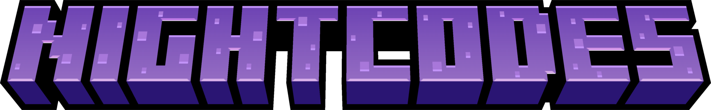

<center>

<p><b>NightCodes</b> - Paper plugin that gives your player ability to create referral codes and get bonuses for inviting new players for your server!</p>

<u>English</u> | <b><a href="README_RU.md">Russian</a></b>
</center>

***

# 🚀 Features

- Store player messages in database with HikariCP:
  - [x] SQLite
  - [ ] MySQL ( #todo )
- **HEX Codes** by MiniMessage support
- Ability to **delete or pause** codes for players
- **Restriction on activation** of codes by minimum playing time (customize in `config.yml`, by default 1 hour)

# 💾 Requirements

- Java **16+**
- Paper (or forks such as Purpur) **1.17+** <u>(not Spigot/CraftBukkit)</u>

# ⚡ Commands and permissions

## /referral

> [!TIP]
> Alias: /ref

#### Usage:
- **/referral create** - Create referral code
  - Permission: `nightcodes.player.create`
- **/referral delete** - Delete referral code
  - Permission: `nightcodes.player.delete`
- **/referral pause** - Pause referral code
  - Permission: `nightcodes.player.pause`
- **/referral unpause** - Unpause referral code
  - Permission: `nightcodes.player.unpause`
- **/referral stats** - Get stats for code
  - Permission: `nightcodes.player.stats`

## /code

#### Usage:
- **/code < code >** - Activate code
  - Permission: `nightcodes.player.activate`

## /nightcodes

> [!TIP]
> Alias: /ncodes

#### Usage:
- **/nightcodes reload** - Reload plugin
  - Permission: `nightcodes.admin.reload`


***


# ⚙ Other information

### If you find a bug or want to help with development, feel free to contact me
  - Contact links [here](https://drakoshaslv.ru/)

### You can also (optionally) donate me:
  - [DonationAlerts](https://www.donationalerts.com/r/mrdrag0nxyt)
  - TON:
    ```
    UQAwUJ_DWQ26_b94mFAy0bE1hrxVRHrq51umphFPreFraVL2
    ```
  - ETH:
    ```
    0xf5D0Ab258B0f8EeA7EA07cF1050B35cc12E06Ab0
    ```


<center><h3>Made specially for <a href="https://nshard.ru">NightShard</a></h3></center>